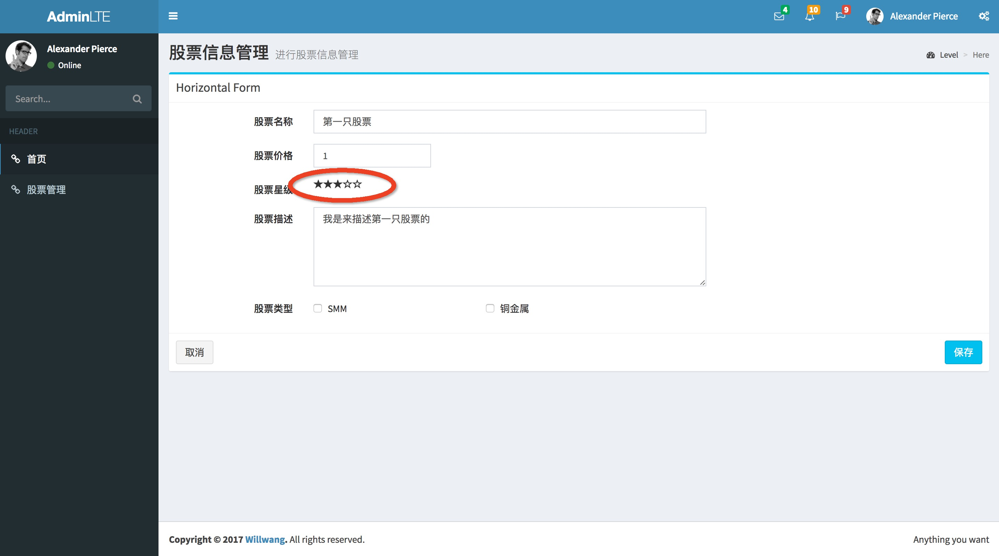
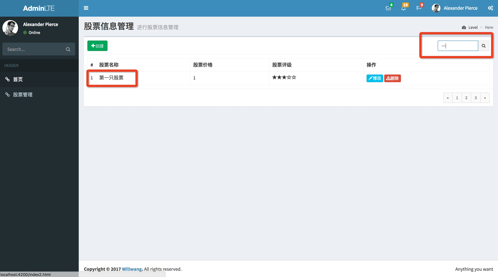

# Stock-management-system
> Angular4.0 + Bootstrap3.0 + AdminLTE + AngularCLI 构建一个股票后台管理系统

## 目录

### 1.实现功能
1. 评价星星组件
  - 组件根据传入的评价分数，动态显示星级
  - readOnly输入属性控制是否可点击操作，改变评级分数
  - 使用了ngOnChanges(){}钩子来处理输入属性值得变化，简化了代码





2. 管道筛选功能
  - 建立的管道接收两个属性：需要筛选的字段name和搜索内容
  

### 2.使用

> clone代码： git clone https://github.com/Willworkgogogo/Stock-management-system.git

> 安装包: npm install

> 在stock目录下启动项目: npm run start

### 3.搭建步骤


### 4.问题汇总


1. 全局样式引入注意细节
```javascript
// 以引入bootstrap.css为例
(项目结构)
-- stock
    -- e2e
    -- node_modules
    -- src
    -- package.json
    -- angular-cli.json
    -- ...
// 这里选择修改angular-cli.json文件apps数组里对象的styles属性，虽然angular-cli.json是和node_modules同级，但是这里却要以src内部文件的位置作为参考， 所以引用node_modules里的文件时，相对地址需要写成"../node_modules/bootstrap/dist/css/bootstrap.css"

```


2. 使用admin-lte时，左边栏无动画效果的原因与解决方法
```javascript
 //我来终结这个问题！！！看了源码，提供两种解决方式！ 

第一种：

我在node_modules里的admin-lte的app.js里仔细查找了关于这个按钮的所有属性，都没找到，然后去了github查看了最新的代码， 人家文件名都换了，不叫app.js了，改成AdminLTE.js了， 然后里面是有[data-toggle=push-menu]获取这个元素，当然绑定了相关方法。我最简单的方式就是把这个文件copy过来，放在和app,js同级目录，引用，页面上效果毫无悬念就出来了。

 <a href="#" class="sidebar-toggle" data-toggle="offcanvas" role="button">


第二种：

像被采纳答案说的，把data-toggle="push-menu"改成data-toggle="offcanvas"。解释下原因，这个东西跟bootstrap没有任何关系，这是admin-lte的一个坑。app.js的第313行开始是关于这个动画效果的js操作，下面是它的完整注释：

/* PushMenu()

  * ==========

  * Adds the push menu functionality to the sidebar.

  *

  * @type Function

  * @usage: $.AdminLTE.pushMenu("[data-toggle='offcanvas']")

  */

我们npm下载的admin-lte里的app.js文件并没有给data-toggle="push-menu"这个按钮加任何操作， 实际人家是要给data-toggle="offcanvas"加左边栏这个效果。

总结下， 我觉得坑是在， admin-lte官方更新了自己网站的代码，但是npm上的并没有更新，所以才导致了这个问题。

第一种解决方案的缺点是，你不能更新admin-lte这个包了。

第二种解决方式的缺点是，当admin-lte官方更新了包后， 你本地必须把已经改成offcanvas的按钮给改回push-menu， 因为官网最新的就是push-menu。

```

-----------
更新2018-01-13
-----------

